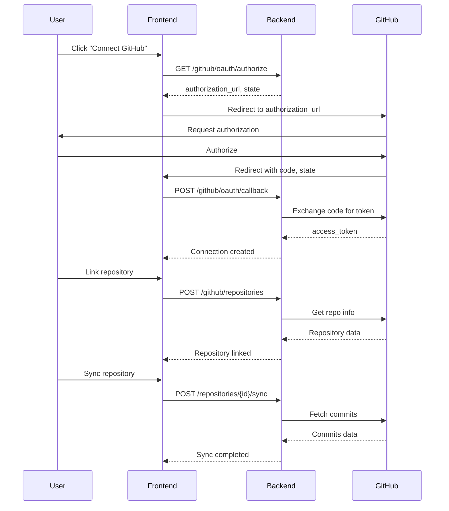

# GitHub Integration Setup Guide

## Overview

This guide explains how to set up GitHub integration for Dev-Log Admin, including:
- GitHub OAuth App configuration
- Webhook setup for real-time updates
- Environment variables configuration

---

## Prerequisites

1. A GitHub account
2. Admin access to the GitHub organization (if connecting organization repos)
3. Access to Dev-Log Admin server configuration

---

## 1. GitHub OAuth App Setup

### Step 1: Create a GitHub OAuth App

1. Go to GitHub Settings: https://github.com/settings/developers
2. Click **OAuth Apps** in the left sidebar
3. Click **New OAuth App**
4. Fill in the application details:

| Field | Value |
|-------|-------|
| Application name | `Dev-Log Admin` (or your preferred name) |
| Homepage URL | `http://localhost:8100` (or your production URL) |
| Authorization callback URL | `http://localhost:8100/api/v2/github/callback` |
| Enable Device Flow | Leave unchecked |

5. Click **Register application**

### Step 2: Get Client Credentials

After creating the app:
1. Copy the **Client ID**
2. Click **Generate a new client secret**
3. Copy the **Client Secret** (save it securely, it won't be shown again)

### Step 3: Configure Scopes

The application requests the following scopes:
- `repo` - Full control of private repositories
- `read:user` - Read user profile data
- `user:email` - Access user email addresses

These scopes are needed for:
- Reading repository information
- Syncing commits and pull requests
- Creating webhooks

---

## 2. Environment Variables

Add these variables to your `.env` file:

```bash
# GitHub OAuth
GITHUB_CLIENT_ID=your_client_id_here
GITHUB_CLIENT_SECRET=your_client_secret_here
GITHUB_CALLBACK_URL=http://localhost:8100/api/v2/github/callback

# GitHub API
GITHUB_API_BASE_URL=https://api.github.com
GITHUB_OAUTH_URL=https://github.com/login/oauth

# Token Encryption (generate with: python -c "from cryptography.fernet import Fernet; print(Fernet.generate_key().decode())")
GITHUB_TOKEN_ENCRYPTION_KEY=your_fernet_key_here

# Webhook (generate a random string)
GITHUB_WEBHOOK_SECRET=your_webhook_secret_here

# Sync Settings
SYNC_BATCH_SIZE=100
SYNC_MAX_COMMITS_PER_REPO=1000
```

### Generating Keys

**Fernet Encryption Key:**
```bash
python -c "from cryptography.fernet import Fernet; print(Fernet.generate_key().decode())"
```

**Webhook Secret:**
```bash
python -c "import secrets; print(secrets.token_urlsafe(32))"
```

---

## 3. Webhook Setup

### Automatic Webhook Setup (Recommended)

The API can automatically create webhooks when linking repositories. This requires the `repo` scope.

### Manual Webhook Setup

If you prefer to set up webhooks manually:

1. Go to your repository on GitHub
2. Click **Settings** > **Webhooks** > **Add webhook**
3. Configure:

| Field | Value |
|-------|-------|
| Payload URL | `https://your-domain/api/v2/webhooks/github` |
| Content type | `application/json` |
| Secret | Same as `GITHUB_WEBHOOK_SECRET` in .env |
| SSL verification | Enable (recommended) |
| Events | Select individual events: `push`, `pull_request`, `issues` |

4. Click **Add webhook**

### Supported Webhook Events

| Event | Description |
|-------|-------------|
| `push` | Commits pushed to repository (auto-syncs commits) |
| `pull_request` | PR opened, closed, merged, etc. |
| `issues` | Issue opened, closed, labeled, etc. |
| `create` | Branch or tag created |
| `delete` | Branch or tag deleted |
| `release` | Release published |
| `ping` | Webhook test |

---

## 4. API Usage

### Connect GitHub Account

1. **Get Authorization URL:**
```bash
curl -X GET "http://localhost:8100/api/v2/github/oauth/authorize" \
  -H "Authorization: Bearer YOUR_JWT_TOKEN"
```

Response:
```json
{
  "authorization_url": "https://github.com/login/oauth/authorize?...",
  "state": "random_state_string"
}
```

2. **Redirect user to `authorization_url`**

3. **Handle Callback:**
After user authorizes, GitHub redirects to callback URL with `code` and `state` parameters.

```bash
curl -X POST "http://localhost:8100/api/v2/github/oauth/callback" \
  -H "Authorization: Bearer YOUR_JWT_TOKEN" \
  -H "Content-Type: application/json" \
  -d '{"code": "github_code", "state": "state_from_step_1"}'
```

### Link Repository

```bash
curl -X POST "http://localhost:8100/api/v2/github/repositories" \
  -H "Authorization: Bearer YOUR_JWT_TOKEN" \
  -H "Content-Type: application/json" \
  -d '{
    "project_id": "your_project_uuid",
    "owner": "github_username_or_org",
    "name": "repository_name"
  }'
```

### Trigger Manual Sync

```bash
curl -X POST "http://localhost:8100/api/v2/github/repositories/{repository_id}/sync" \
  -H "Authorization: Bearer YOUR_JWT_TOKEN" \
  -H "Content-Type: application/json" \
  -d '{
    "sync_commits": true,
    "sync_issues": false,
    "sync_prs": false,
    "full_sync": false
  }'
```

### Check Rate Limit

```bash
curl -X GET "http://localhost:8100/api/v2/github/rate-limit" \
  -H "Authorization: Bearer YOUR_JWT_TOKEN"
```

---

## 5. Security Considerations

### Token Storage

- GitHub tokens are encrypted using Fernet symmetric encryption
- The encryption key should be kept secure and never committed to version control
- Tokens are associated with individual users, not shared

### Webhook Verification

- All webhook payloads are verified using HMAC-SHA256 signatures
- The webhook secret must match between GitHub and the server
- Invalid signatures result in 401 Unauthorized responses

### Rate Limiting

- GitHub API has rate limits (5000 requests/hour for authenticated requests)
- The API tracks remaining limits and returns rate limit info
- Sync operations respect batch sizes to avoid hitting limits

### Permissions

- Only users with valid GitHub connections can trigger syncs
- Repository access is verified through the user's GitHub token
- Webhook events are processed regardless of user authentication

---

## 6. Troubleshooting

### OAuth Errors

**"GitHub OAuth is not configured"**
- Check that `GITHUB_CLIENT_ID` and `GITHUB_CLIENT_SECRET` are set

**"Invalid authorization code"**
- Authorization codes expire after 10 minutes
- Each code can only be used once

### Webhook Issues

**"Invalid webhook signature"**
- Verify `GITHUB_WEBHOOK_SECRET` matches the secret in GitHub webhook settings
- Check that the payload is not being modified by any proxy

**Webhook not triggering**
- Check webhook delivery history in GitHub repository settings
- Verify the webhook URL is publicly accessible
- Check server logs for incoming requests

### Sync Errors

**"No valid GitHub connection found"**
- User needs to connect their GitHub account first
- Check if the connection has expired or been revoked

**"Failed to get repository info"**
- Verify repository exists and user has access
- Check if repository is private and user has appropriate permissions

---

## 7. API Reference

### OAuth Endpoints

| Method | Endpoint | Description |
|--------|----------|-------------|
| GET | `/api/v2/github/oauth/authorize` | Get OAuth authorization URL |
| POST | `/api/v2/github/oauth/callback` | Handle OAuth callback |
| GET | `/api/v2/github/connection` | Get connection status |
| DELETE | `/api/v2/github/connection` | Revoke connection |

### Repository Endpoints

| Method | Endpoint | Description |
|--------|----------|-------------|
| GET | `/api/v2/github/repositories/available` | List available repos |
| POST | `/api/v2/github/repositories` | Link a repository |
| GET | `/api/v2/github/repositories/{id}` | Get repository details |
| PATCH | `/api/v2/github/repositories/{id}` | Update sync settings |
| DELETE | `/api/v2/github/repositories/{id}` | Unlink repository |

### Sync Endpoints

| Method | Endpoint | Description |
|--------|----------|-------------|
| POST | `/api/v2/github/repositories/{id}/sync` | Trigger sync |
| GET | `/api/v2/github/repositories/{id}/sync/status` | Get sync status |
| GET | `/api/v2/github/repositories/{id}/sync/history` | Get sync history |

### Webhook Endpoints

| Method | Endpoint | Description |
|--------|----------|-------------|
| POST | `/api/v2/webhooks/github` | Receive webhook events |
| GET | `/api/v2/webhooks/github/events` | List webhook events |
| GET | `/api/v2/webhooks/github/events/{id}` | Get event details |

### Utility Endpoints

| Method | Endpoint | Description |
|--------|----------|-------------|
| GET | `/api/v2/github/rate-limit` | Get API rate limit status |

---

## 8. Example Integration Flow



---

## Support

For issues or questions:
1. Check the troubleshooting section above
2. Review server logs for detailed error messages
3. Open an issue on the project repository
